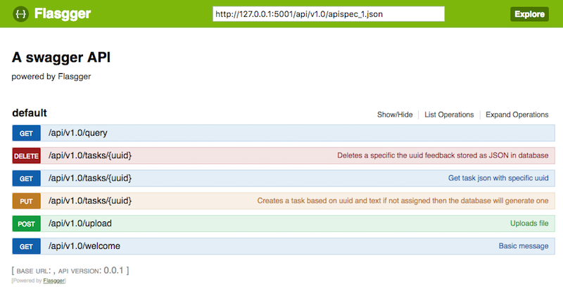

# TL;DR

Flask, Flask-Restful, SQLAlChemy and Flasgger (OpenAPI) code to bootstrap REST API projects.

Clone and run:

```
git clone https://github.com/GeoCat/REST-Flask-boostrap.git
cd REST-Flask-boostrap.git
pip3 install -r requirements.txt
python3 ./app.py
```

Open browser and go to:

```
http://127.0.0.1:5001/api/v1.0/apidocs#/default
```

Play around :)

# GENERAL INFORMATION

*REST-Flask-boostrap* contains a generic Flask boilerplate
for rapid development of REST interfaces. There are very good Flask resources online, like:

[https://github.com/humiaozuzu/awesome-flask](https://github.com/humiaozuzu/awesome-flask)

But, sometimes putting everything together can be quite involved. 
*REST-Flask-boostrap* contains bootstrap code to get you started 
developing your own REST server, and/or can be used as study-material.

The project requires the following packages, see [requirements.txt](requirements.txt) for versions
used:

* Flask
* Flask_RESTful
* Flask_SQLAlchemy
* SQLAlchemy
* marshmallow
* webargs
* flasgger
* Flask_Env

Python version: 3.6.

The code presented here is one way to put it together.
If you have suggestions for improvements, please fork this repository (and clone your forked version)
and request updates via Pull Requests. We welcome your contributions!

Our main objective is that the code as presented here is simple, straightforward and Pythonic. 

**Let the code speak for itself**

# Setup and run

Clone the repository (or your fork) to your local computer:

```
https://github.com/GeoCat/REST-Flask-boostrap.git 
```

You may want to use Python3 Virtualenv (recommended!) first:

```
python3 -m venv /path/to/your/venv/dir
. /path/to/your/venv/dir/bin/activate 

```

To run the code just call `app.py`:

```
cd  REST-Flask-boostrap.git
pip3 install -r requirements.txt
python3 app.py
```

The `app.py` will start the Flask server with contents.

To evaluate the REST API, check the OpenAPI docs: 

```
http://127.0.0.1:5001/api/v1.0/apidocs#/default
```

Flasgger is able to do REST calls to the different endpoints, with example data. 
If necessary there are text files for testing in folder `tests/data`

# Package Integration

The following packages/frameworks are part of the code:

* [Flask-Restful](https://flask-restful.readthedocs.io) - Functions/Classes for REST API.
* [webargs](https://github.com/sloria/webargs) - Argument validation and check
* [Flask_Env](https://github.com/brettlangdon/flask-env) - Flask configuration using classes
* [Flask_SQLAlchemy](http://flask-sqlalchemy.pocoo.org/2.3/) - SQLAlchemy for database access and record control
* [flasgger](https://github.com/rochacbruno/flasgger) - Testing REST and documenting functionality

# app.py

This is the python file from where we start Flask REST api, [read it here](app.py). 

# REST Structure

Flask-Restful (F-R) uses a very straightforward class structure.
Read more details [in the F-R documentation](https://flask-restful.readthedocs.io).

Each endpoint is represented as a class located in the folder `./resources/v1`. 

The nice thing about Flask-Restful is that each HTTP Verb is a simple class method.
Below an example for an HTTP GET:

```
class Welcome(Resource):
   def get(self):
       now = datetime.datetime.now()
       app.logger.debug("Time of request {}".format(now))
       return jsonify({"message":"Lekker!!!", "version": app.config["VERSION"], "date": now})
```


REST endpoints are registered in the file: [app.py](app.py) e.g:

```
from resources.v1.welcome import Welcome
....
API10.add_resource(Welcome, '/welcome')
```

The REST endpoint `/welcome` is now mapped to the class [Welcome](resources/v1/welcome.py). 
Note in [app.py](app.py) that we use [Flask Blueprints](http://flask.pocoo.org/docs/1.0/blueprints/):

```
APP = Flask(__name__)
BLUEPRINT = Blueprint('tree', __name__)
PREFIX = "/api/v1.0"
API10 = Api(BLUEPRINT, prefix=PREFIX)
```

Therefore, the actual URL for the endpoint will be something like `http://localhost:5001/api/v1.0/welcome`

For more information about Flask Blueprints read [here](http://flask.pocoo.org/docs/0.12/blueprints/).

# Webargs

There are a zillion ways to check arguments and requests being passed to Flask, 
even Flask-Restful has amazing stuff, but `Webargs` is very simple and 
gets the job done integrated on the classes from Flask-Restful without explicit coding.

Webargs docs are [here](https://webargs.readthedocs.io/en/latest/).

The idea is to use Webargs as class variables (code in classes of folder `./resources/v1/`):

```
class Query(Resource):
    """Query class testing 2 inputs one numerical other string"""
    args = {
        'number': fields.Float( #pylint: disable=E1101
            required=True,
            validate=lambda x: -1.0 <= x <= 1.0
        ),
        'string' : fields.Str( #pylint: disable=E1101
            required=False,
            validate=lambda x: x in ["dog", "cat"]
        )
    }
    @use_kwargs(args)
    @swag_from("swagger/query.yml")
    def get(self, number, string): #pylint: disable=R0201
        """Method returning input"""
        return jsonify(number=number, string=string)
```

Looking into the class [Query](resources/v1/query.py) and its `get()` method, we see 
two input arguments defined: **number** and **string**.

`number` will be validated for values between `-1.0` and `1.0` while `string` has to be `"dog"` or `"cat"`.

The decorator `@use_kwargs` on the `get()` method is from package Webargs.

# OpenAPI Flasgger

OpenAPI is an open specification for describing, consuming and generating contents for 
REST-based web services, 
for more information see the [OpenAPI Specification](https://github.com/OAI/OpenAPI-Specification).

[Swagger](https://swagger.io/) is an implementation of the OpenAPI.

[Flasgger](https://github.com/rochacbruno/flasgger) is an OpenAPI/Swagger implementation for Flask.

Normally we have tools like `Postman` for testing REST endpoints, since it is simple to make 
an HTTP call from your browser. But when running Swagger (and thus Flasgger),
we have a dedicated website for testing and documenting the API automagically.
With argument validation, default test-data and auto-generated documentation.

Your REST needs to be described as a YAML (`.yml`) document, 
for each endpoint we define a YAML file. These are here located in the folder: `/resources/v1/swagger` 

The core idea is that docs should be the closest possible to the class running the endpoint. 

Please read the Flasgger docs: [here](https://github.com/rochacbruno/flasgger).

Each Flask-REST class has a decorator pointing to the documentation:

```
from flasgger import swag_from
class Welcome(Resource):
    """Welcome class for testing REST"""
    @swag_from('swagger/welcome.yml')
    def get(self):
        now = datetime.datetime.now()
        app.logger.debug("Time of request {}".format(now))
        return jsonify({"message":"Lekker!!!", "version": app.config["VERSION"], "date": now})
```

Each method can have a different `.yml` file. 
The Flasgger module will bundle everything and make a full documentation set, accessible
in your running Flask server via:

```
http://127.0.0.1:5001/api/v1.0/apidocs#/default
```



You will learn a lot by playing with the system :), just try!

# Configuration with Flask_Env

Configuration classes are in the folder `etc/__init__.py`

Flask can be configured using `.yml` files, classes, 
dictionarties etc etc. Major problem is to diferentiate between production and development
deployments. By using class-inheritance for our Flask-configuration we have
one base class containing all settings and child classes with 
minor modifications specific to each deployment environment.

Flask configuration docs are [here](http://flask.pocoo.org/docs/0.12/config/).

In the docs we have something "ugly":

```
app.config.from_object('configmodule.ProductionConfig')
```

The config module is imported as a string. Find this strange?

[Flask_Env](https://github.com/brettlangdon/flask-env) allows loading a Python 
class (string name) as configuration!

In [app.py](app.py):

```
from etc import DevelopmentConfig as Config
APP.config.from_object(Config)
```

And in `__init__.py` in folder `etc/`:

```
from flask_env import MetaFlaskEnv
import os, tempfile

from __init__ import __version__

# pylint: disable=too-few-public-methods
class BaseConfig(metaclass=MetaFlaskEnv):
    """BaseClass from where other configurations will de derived"""
    DEBUG = True
    SQLALCHEMY_TRACK_MODIFICATIONS = False # Just to remove the warning and tracking of SQLALCHEMY 
    DBPATH= os.path.join(".", "task_database.db")
    SQLALCHEMY_DATABASE_URI = 'sqlite:///{}'.format(DBPATH)
    LOG_FILE = "flask.log"
    UPLOAD_FOLDER = tempfile.mkdtemp(prefix="rest_api") 
    PORT = 5001
    MAX_UPLOAD = 100
    VERSION = __version__
    HOST = "0.0.0.0"
```

The advantage of class config is that we can use python code to set parameters e.g: `UPLOAD_FOLDER = tempfile.mkdtemp(prefix="rest_api")`

# Flask-SQLAlchemy

*"[SQLAlchemy](https://www.sqlalchemy.org/) is the Python SQL toolkit and Object Relational Mapper that gives application developers the full power and flexibility of SQL."*

The concept of SQLAlchemy is that a database structure is mapped as Python classes, atributes, methods etc etc. 

*"[Flask-SQLAlchemy](http://flask-sqlalchemy.pocoo.org/) is an extension for Flask that adds support for SQLAlchemy to your application."*

Both have overwhelming documentation.
Start with the generic docs [here](http://flask-sqlalchemy.pocoo.org/2.3/).

The REST endpoint `/tasks` is a classic example of SQLAlchemy:

* the REST endpoint is defined in [tasks.py](resources/v1/tasks.py)
* the models are in [models.py](resources/database/models.py).

This topic is too extensive to be described in a *README.md*... 

# Contact

* [Jorge S. Mendes de Jesus](https://github.com/jorgejesus)
* [Anton Bakker](https://github.com/arbakker)

# Contributions
 
[Just van den Broecke](https://github.com/justb4)
